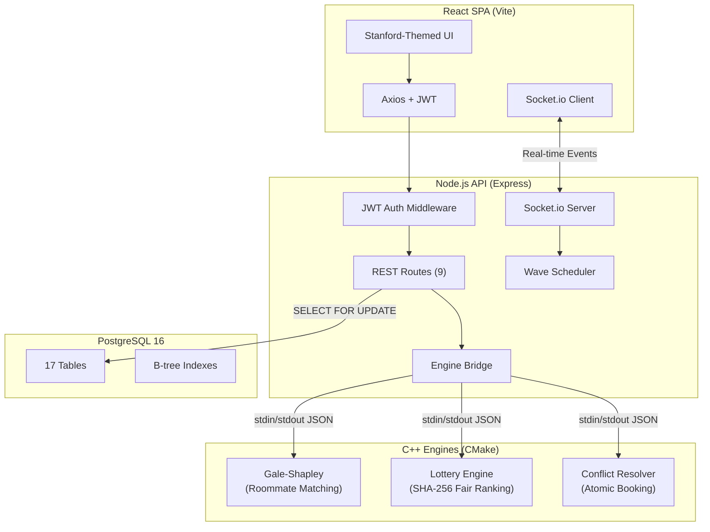

# DormSphere — System Architecture

## Overview
DormSphere is an intelligent hostel management platform for IIITDMK, designed for 2000+ concurrent students.

## Data Flow — Room Selection
1. Student clicks room in `RoomArena`
2. `POST /api/rooms/:id/attempt` → Express route
3. `BEGIN TRANSACTION` → `SELECT ... FOR UPDATE` (row-level lock)
4. If available: update + assign → `COMMIT`
5. WebSocket broadcast → all connected clients update in <100ms
6. If full: log failed attempt → `COMMIT` → demand signal broadcast

## Security Architecture
| Feature | Implementation |
|---------|---------------|
| Authentication | JWT (HS256, 24h expiry) |
| Password Storage | bcrypt (10 rounds) |
| Role Authorization | Middleware guard: student/warden/guard/judcomm |
| Outpass | HMAC-SHA256 signed QR codes |
| Grievance Vault | AES-256-GCM (IV + AuthTag, encrypted at rest) |
| Elections | DB unique constraint: `(election_id, voter_id)` |
| Room Booking | PostgreSQL `SELECT FOR UPDATE` row locks |

## Technology Stack
| Layer | Technology |
|-------|-----------|
| Frontend | React 18, Vite 5, Socket.io Client |
| Backend | Node.js, Express, TypeScript, Socket.io |
| Database | PostgreSQL 16 |
| Engines | C++17, CMake, OpenSSL, pthreads |
| Auth | JWT, bcrypt |
| Crypto | AES-256-GCM, HMAC-SHA256, SHA-256 |
